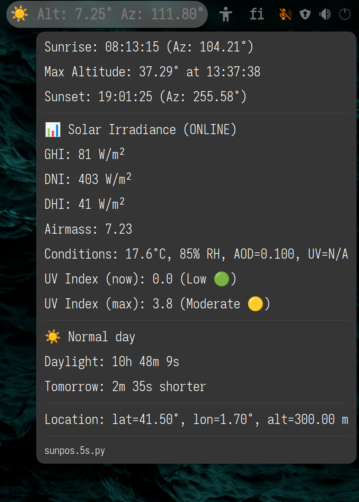

## Setup

Step 1a: Install argos from `https://github.com/p-e-w/argos`

Step 1b: Maybe install pvlib (and numba if you wish): `python3 -m pip install --upgrade --user pvlib`

Step 2: Maybe restart gnome-shell

Step 3: Enable argos in gnome-extensions-app

Step 4: Create config file `~/.config/argos-sunpos.json`
```json
{
  "latitude": 64.1,
  "longitude": 22.1,
  "altitude": 123,
  "timezone": "Europe/Helsinki",
  "offline": true
}
```
Step 5: Make sure needed directories exist:
```bash
mkdir -p ~/.local/bin
mkdir -p ~/.config/systemd/user
```

Step 6: `install -m755 argos-sunpos-service.py ~/.local/bin && install -m 600 argos-sunpos.service ~/.local/share/systemd/user && systemctl --user daemon-reload && systemctl --user enable argos-sunpos && systemctl --user start argos-sunpos`

Step 7: `install -d ~/.config/argos && install -m755 sunpos.30s.py ~/.config/argos/`

Step 8: Sun information is shown and updated every 30 seconds, and the config file is
read on each run.  If you edit `sunpos.30s.py` and your editor makes backup of
it with execution bit set, those scripts are also run, so maybe don't create
backups in that directory [this is a reported bug or feature in argos (year
2018)].  To update every 5s, rename the script to `sunpos.5s.py`.

For more accurate solar irradiance estimation, change `offline` to `false`.
Location is truncated to one decimal in this case when sent to NASA's API
(11 km error).  With `offline=true` a less accurate Ineichen model is used,
otherwise Simplified Solis.  UV Index estimation takes into account the
location's elevation.

## Testing
Status:
```bash
echo "STATUS" | socat - ABSTRACT-CONNECT:argos-sunpos-$(id -u) | jq .
ss -xlp | grep argos-sunpos
```

Benchmark:
```bash
time echo "GET" | socat - ABSTRACT-CONNECT:argos-sunpos-$(id -u)
```

Restart the service if you change the python service:
```bash
systemctl --user restart argos-sunpos
```

## Screenshot

